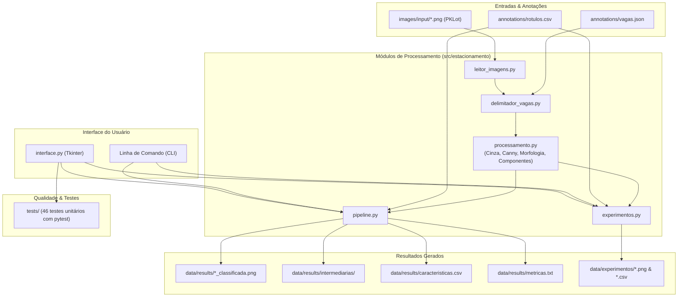

# Diagrama de Arquitetura — M2

## Versão em Mermaid (Renderização Nativa)

```mermaid
graph TD
    subgraph UI ["Interface do Usuário"]
        GUI["interface.py (Tkinter)"]
        CLI["Linha de Comando (CLI)"]
    end

    subgraph Dados ["Entradas & Anotações"]
        IMG["images/input/*.png (PKLot)"]
        JSON["annotations/vagas.json"]
        CSV["annotations/rotulos.csv"]
    end

    subgraph Modulos ["Módulos de Processamento (src/estacionamento)"]
        LEITOR["leitor_imagens.py"]
        DELIM["delimitador_vagas.py"]
        PROC["processamento.py<br/>(Cinza, Canny, Morfologia, Componentes)"]
        PIPE["pipeline.py"]
        EXP["experimentos.py"]
    end

    subgraph Testes ["Qualidade & Testes"]
        PYTEST["tests/ (46 testes unitários com pytest)"]
    end

    subgraph Saidas ["Resultados Gerados"]
        RES_IMG["data/results/*_classificada.png"]
        RES_PANEL["data/results/intermediarias/"]
        RES_CSV["data/results/caracteristicas.csv"]
        RES_TXT["data/results/metricas.txt"]
        EXP_PLOTS["data/experimentos/*.png & *.csv"]
    end

    GUI --> PIPE
    GUI --> EXP
    GUI --> PYTEST
    CLI --> PIPE
    CLI --> EXP

    IMG --> LEITOR
    LEITOR --> DELIM
    JSON --> DELIM
    DELIM --> PROC
    CSV --> EXP
    CSV --> PIPE

    PROC --> PIPE
    PROC --> EXP

    PIPE --> RES_IMG
    PIPE --> RES_PANEL
    PIPE --> RES_CSV
    PIPE --> RES_TXT
    EXP --> EXP_PLOTS
```
