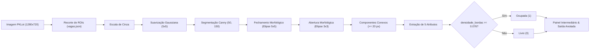

# Diagrama do Pipeline — M2

## Versão em Mermaid (Renderização Nativa)

```mermaid
flowchart LR
    A["Imagem PKLot (1280x720)"] --> B["Recorte de ROIs (vagas.json)"]
    B --> C["Escala de Cinza"]
    C --> D["Suavização Gaussiana (5x5)"]
    D --> E["Segmentação Canny (50, 150)"]
    E --> F["Fechamento Morfológico (Elipse 5x5)"]
    F --> G["Abertura Morfológica (Elipse 3x3)"]
    G --> H["Componentes Conexos (>= 20 px)"]
    H --> I["Extração de 5 Atributos"]
    I --> J{"densidade_bordas >= 0.076?"}
    J -- Sim --> K["Ocupada (1)"]
    J -- Não --> L["Livre (0)"]
    K --> M["Painel Intermediário & Saída Anotada"]
    L --> M
```
